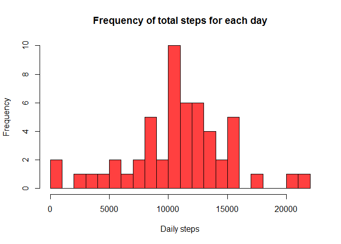
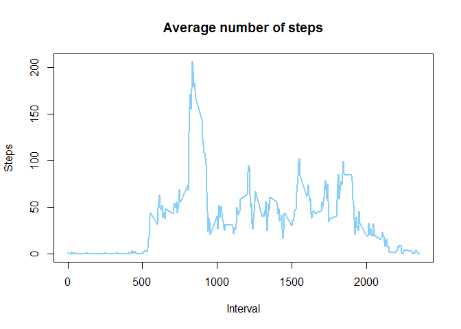
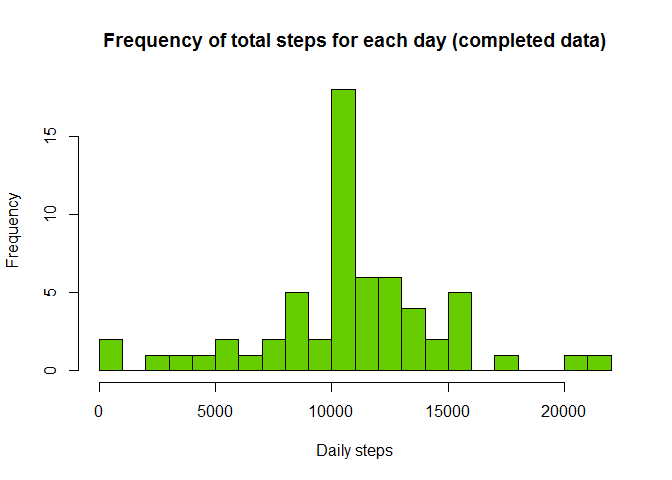
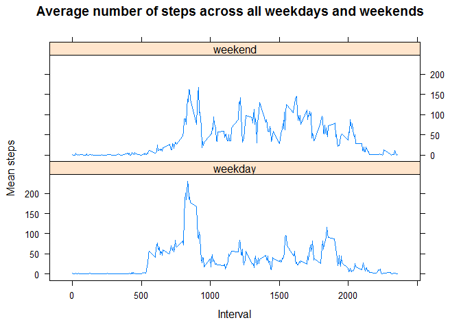

# Reproducible Research: Peer Assessment 1


## Loading and preprocessing the data

Load necessary packages to process and plot data. Disable scientific notation for outputs.


```r
library(data.table)
library(lattice)
options(scipen=999)
```

Download the data if it doesn't already exist in the 'data' folder and unzip.


```r
## Create "data" directory if doesn't already exist. 
if(!file.exists("data")) {
    dir.create("data")
}

## Download and unzip dataset if doesn't already exist
if(!file.exists("data/activity.csv")) {
    temp <- tempfile()
    fileUrl <- "https://d396qusza40orc.cloudfront.net/repdata%2Fdata%2Factivity.zip"
    download.file(fileUrl, temp, mode="wb")
    unzip(temp, exdir="data")
}
```

Load dataset into a dataframe and do a preliminary analysis.


```r
data <- read.csv("data/activity.csv")
str(data)
```

```
## 'data.frame':	17568 obs. of  3 variables:
##  $ steps   : int  NA NA NA NA NA NA NA NA NA NA ...
##  $ date    : Factor w/ 61 levels "2012-10-01","2012-10-02",..: 1 1 1 1 1 1 1 1 1 1 ...
##  $ interval: int  0 5 10 15 20 25 30 35 40 45 ...
```

```r
head(data)
```

```
##   steps       date interval
## 1    NA 2012-10-01        0
## 2    NA 2012-10-01        5
## 3    NA 2012-10-01       10
## 4    NA 2012-10-01       15
## 5    NA 2012-10-01       20
## 6    NA 2012-10-01       25
```

Load data into a data table for further processing. Identify NA values and format date column.


```r
data <- data.table(data, na.strings="NA")

## Format date column as date
data$date <- as.Date(data$date, "%Y-%m-%d")
```

## What is mean total number of steps taken per day?


```r
## Group data by date and get the sum of steps for each day. Plot results.
data_day <- data[, list(sum_steps=sum(steps)), by=date]
hist(x=data_day$sum_steps, 
     breaks=20,
     xlab="Daily steps",
     main="Frequency of total steps for each day",
     col=colours()[33])
```

\

```r
## Mean and median number of steps taken each day - ignoring NA values.
mean_steps <- mean(data_day$sum_steps, na.rm=T)
mean_steps
```

```
## [1] 10766.19
```

```r
median_steps <- median(data_day$sum_steps, na.rm=T)
median_steps
```

```
## [1] 10765
```

The mean number of steps taken per day is **10766.19** and the median is **10765**.

## What is the average daily activity pattern?

Plot a chart showing the average number of steps taken in each interval during the study. 


```r
## Group data by interval and add column showing mean steps for each time interval.
data_interval <- data[, list(mean_steps=mean(steps, na.rm=T)), by=interval]

##  Time series plot of the average number of steps taken
plot(data_interval$interval,
     data_interval$mean_steps, 
     type="l",
     col=colours()[430],
     lwd=2,
     xlab="Interval",
     ylab="Steps",
     main="Average number of steps")
```

\


```r
## Get interval with the maximum number of steps
max_steps <- max(data_interval$mean_steps)
max_steps
```

```
## [1] 206.1698
```

```r
max_interval <- data_interval[which.max(mean_steps), interval]
max_interval
```

```
## [1] 835
```

The 5-minute interval that, on average, contains the maximum number of steps is **835**, with **206** steps.

## Imputing missing values


```r
## Calculate and report the total number of missing values in the dataset 
## (i.e. the total number of rows with NAs)
missing_steps <- sum(is.na(data$steps))
missing_steps
```

```
## [1] 2304
```

There are **2304** observations with missing values.

Create a dataset with the missing observations of steps replaced with the mean number of steps in that interval.


```r
## Make a copy of the original dataset and add column of mean steps at each interval
data_complete <- data.table(data) 
data_complete[, `:=`( mean_steps=as.integer(round(mean(steps, na.rm=T)))), by=interval]

## Function to replace NA values in 'steps' with the 'mean_steps' value
fillNAs <- function(data_in){
    data_in[is.na(steps), steps := mean_steps]
}        

fillNAs(data_complete)
str(data_complete)
```

```
## Classes 'data.table' and 'data.frame':	17568 obs. of  5 variables:
##  $ steps     : int  2 0 0 0 0 2 1 1 0 1 ...
##  $ date      : Date, format: "2012-10-01" "2012-10-01" ...
##  $ interval  : int  0 5 10 15 20 25 30 35 40 45 ...
##  $ na.strings: chr  "NA" "NA" "NA" "NA" ...
##  $ mean_steps: int  2 0 0 0 0 2 1 1 0 1 ...
##  - attr(*, ".internal.selfref")=<externalptr>
```


## Are there differences in activity patterns between weekdays and weekends?

Get the sum of steps for each day from the 'completed' data and plot.


```r
## Aggregate complete dataset for each day with sum of steps for each day. Plot result.
data_complete_day <- data_complete[, list(sum_steps=sum(steps)), by=date]
hist(x=data_complete_day$sum_steps, 
     breaks=20,
     xlab="Daily steps",
     main="Frequency of total steps for each day (completed data)",
     col=colours()[50])
```

\


```r
## Get the mean and median number of daily steps
complete_mean_steps <- mean(data_complete_day$sum_steps, na.rm=T)
complete_mean_steps
```

```
## [1] 10765.64
```

```r
complete_median_steps <- median(data_complete_day$sum_steps, na.rm=T)
complete_median_steps
```

```
## [1] 10762
```

For the 'completed' dataset, the mean number of steps taken per day is **10765.64** and the median is **10762**; compared to **10766.19** and **10765** in the raw data.

Comparison of weekday activity against weekend activity using the 'completed' dataset.


```r
## Add column identifying weekdays and weekends.
data_complete$day_type <- ifelse(grepl("S(at|un)", weekdays(data_complete$date, abbr=T)), 
                                 "weekend", "weekday") 

## Calculate mean number of steps for each interval, for weekdays and weekends. 
data_complete_weekday <- data_complete[, list(mean_steps=mean(steps)), 
                                       by=list(interval, day_type)]

## Panel plot comparing the average number of steps taken per 5-minute interval across weekdays and weekends
xyplot(data_complete_weekday$mean_steps ~ data_complete_weekday$interval|data_complete_weekday$day_type, 
        main="Average number of steps across all weekdays and weekends",
        xlab="Interval",
        ylab="Mean steps",
        layout=c(1,2),
        type="l"
)
```

\


